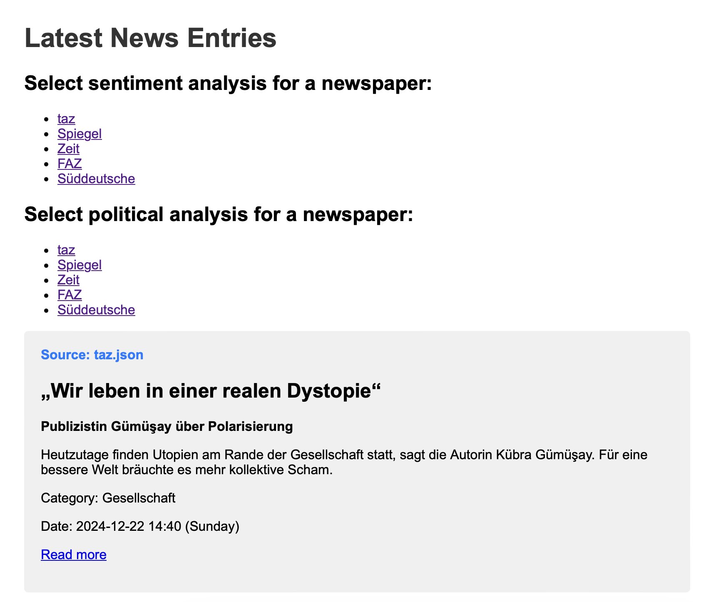
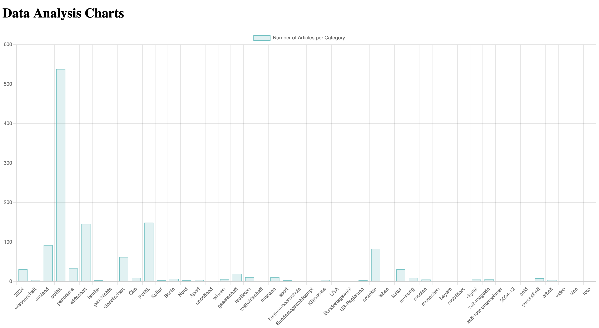
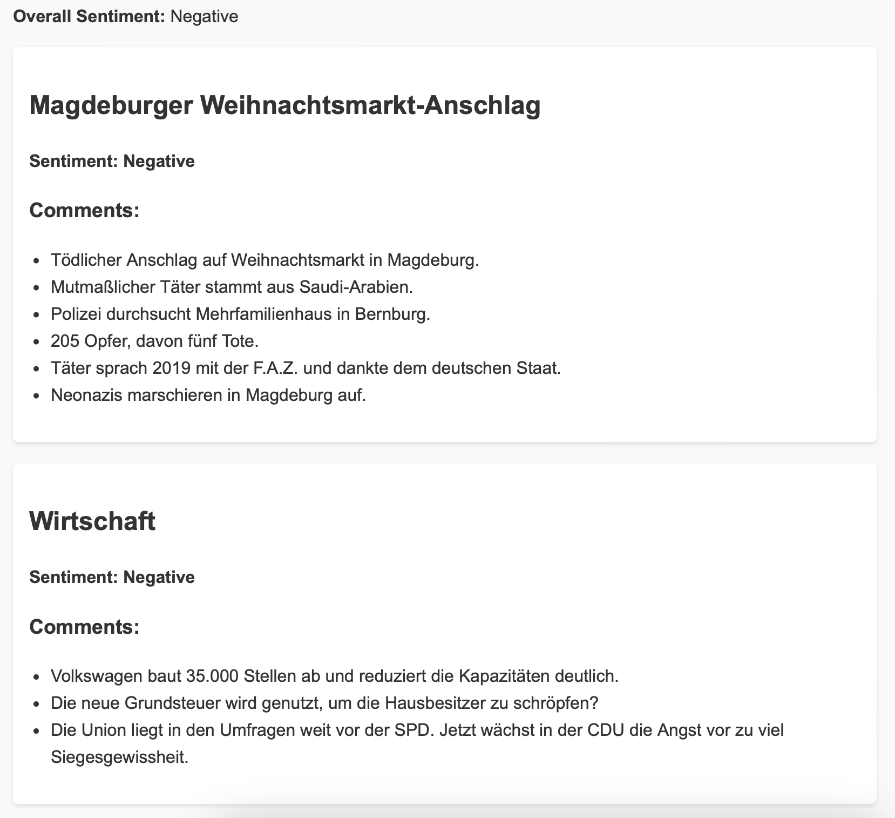
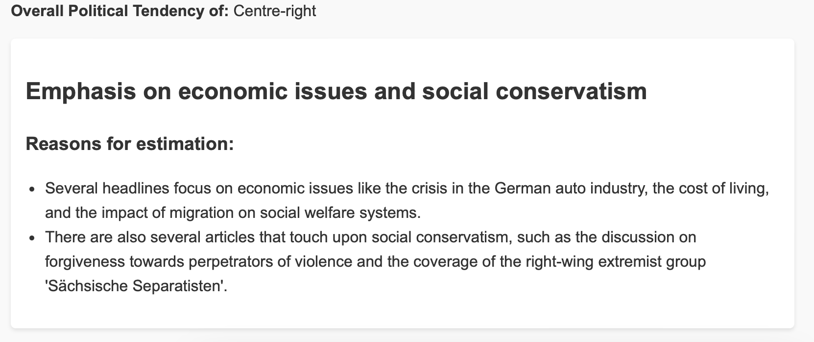

# Newspaper Scraper and Analysis 📰📊

This program scrapes the latest headlines from major German newspapers. It compares the newspapers based on their content and categories, providing numerical insights and advanced sentiment analysis. 

## Features ✨

- **Headline Scraping**: Automatically collects headlines from various German newspapers.
- **Content Comparison**: Compares newspapers based on their content and categories.
- **Sentiment Analysis**: Analyzes the sentiment of the headlines to provide insights.

## The app in action 📸

  
*The start page of the app*

  
*One of the graphical charts to understand the scraped data better*

  
*Example of the LLM-powered sentiment analysis*

  
*Example of the LLM-powered political tendency analysis including reasoning*
